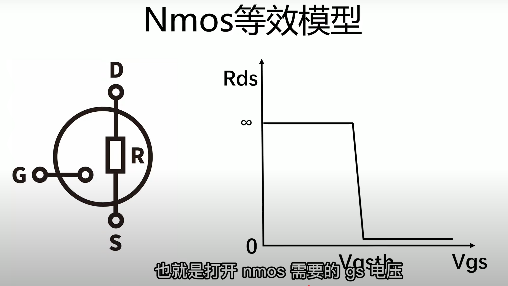
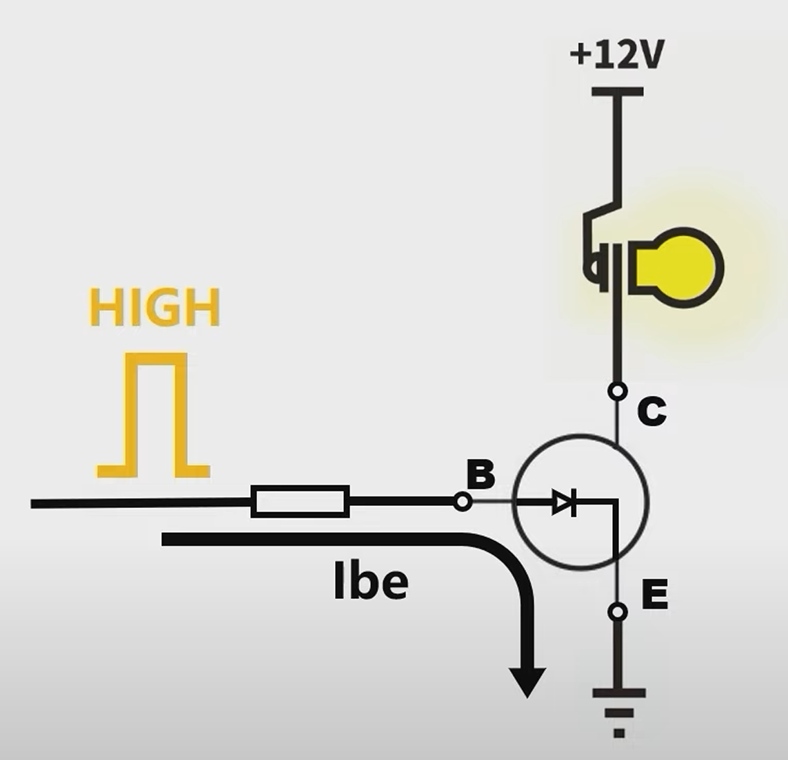
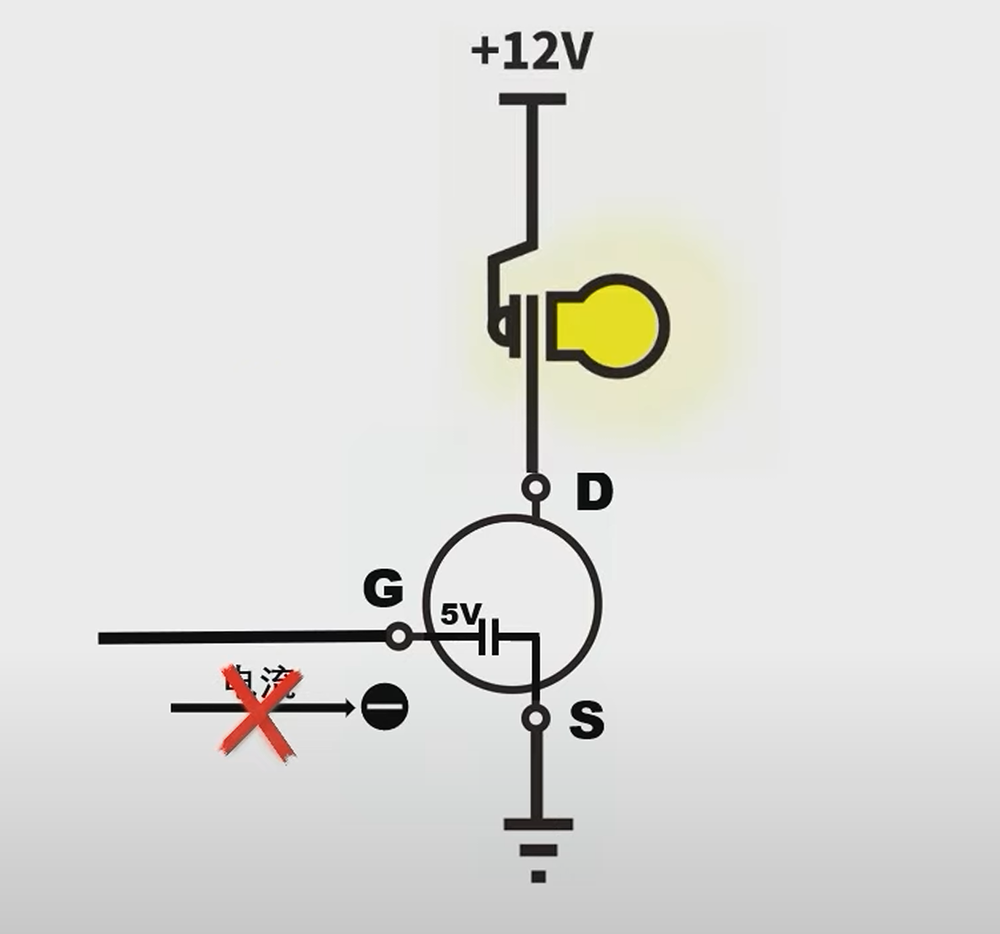
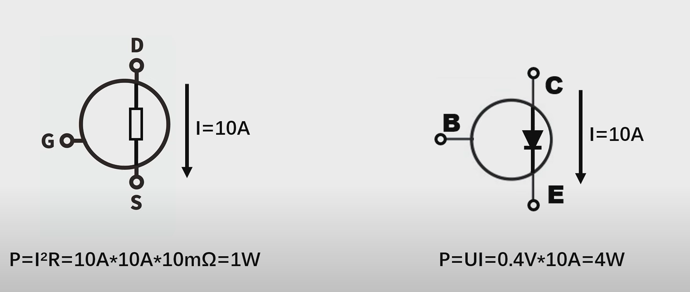
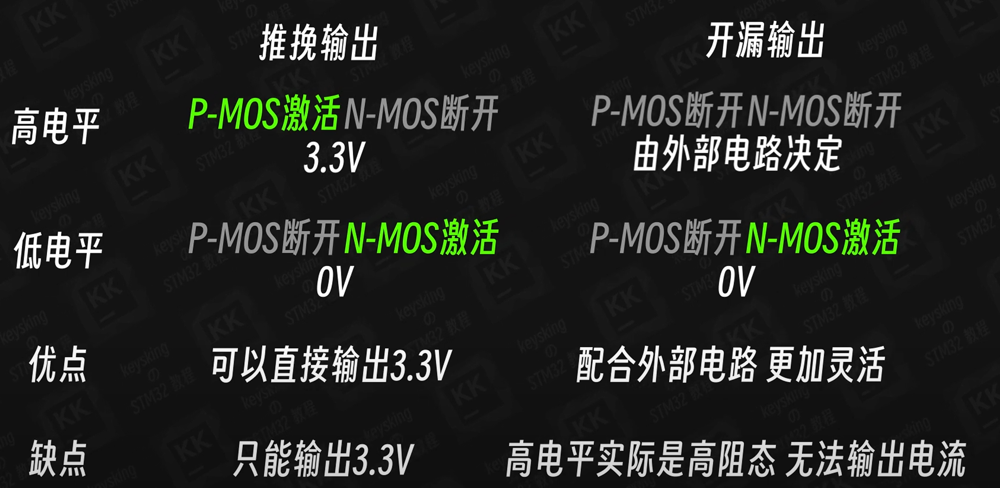
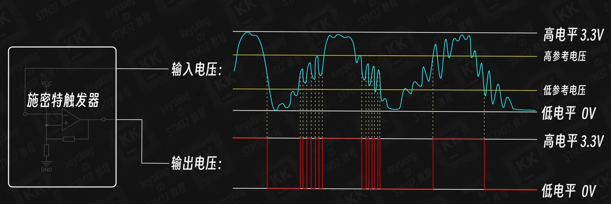
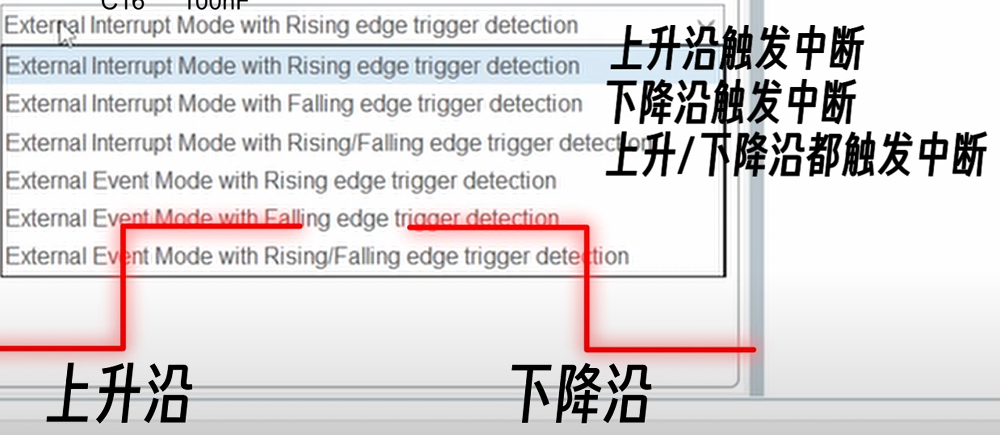
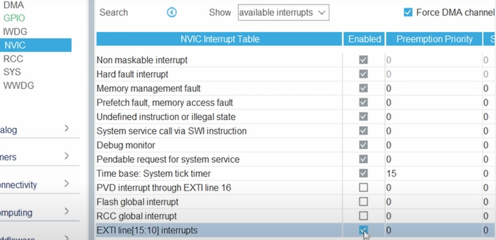
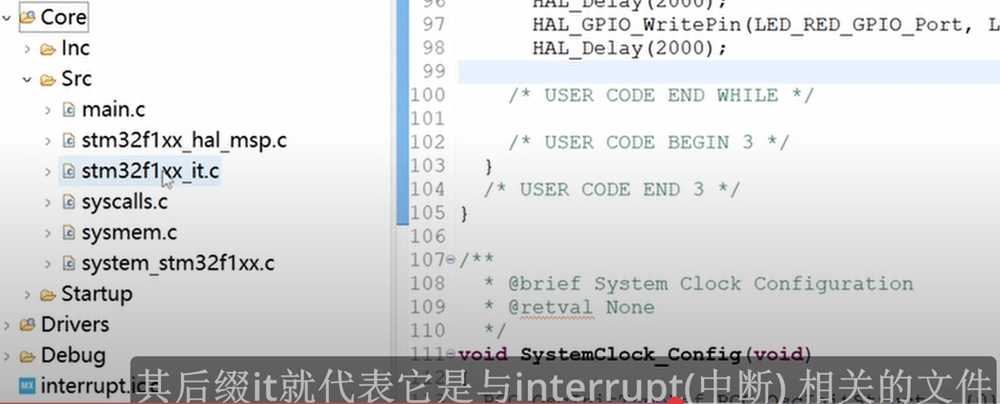
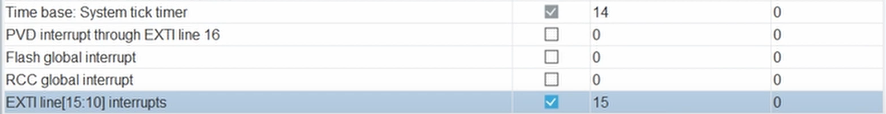

### 今日參考影片

NMOS, PMOS: [愛上半導體動詳解](https://www.youtube.com/watch?v=HtE6inJg2XQ)

NMOS應用: [工科男孫老師](https://www.youtube.com/watch?v=fdaP0KGb954)

三極管和MOS管差別:[工科男孫老師](https://www.youtube.com/watch?v=SCLXFMR-UcQ)

GPIO內部運作原理: [全網最讚stm32教學](https://www.youtube.com/watch?v=WhHHK5vr1v0&list=PLXhqpdHvPB_FgFjNr1a2qU0JlrRVSY25q&index=6)

中斷: [全網最讚stm32教學](https://www.youtube.com/watch?v=BGsU4xPXcSw&list=PLXhqpdHvPB_FgFjNr1a2qU0JlrRVSY25q&index=7)

---
## MOS管 v.s. 三極管

**MOS管: 電壓控制元件 (D: drain(接致動器輸入端), G: gate(接微處理器輸出), S:source(接致動器輸出端))
三極管: 電流控制元件**

## MOS管優點

### 1.省電
下圖說明在 MOS 管中，**Rds** 是指 MOSFET 在通導（開啟）狀態下，由 Drain 到 Source 之間形成的等效電阻，也就是通態電阻，再導通前他的電阻接近無窮。

下圖說明三極管B, E端需要有持續的電流才能讓C, E導通，若移走了高電平(電流消失)則開關會關閉

下圖說明MOS管的G, S兩端有一個寄生電容(但G和S是沒有導通的)，接通後讓電容充電，即使G端變低電平，D, S端仍然**存在一個電壓差**，所以還是會持續導通一小段時間，這個優點就是較省電

**一個集成電路板裡面如果有上百上千個三極管，那麼功耗將會相當可怕**

### 2.導通阻抗小

下圖說明MOS管導通後D, S端形成非常小的等效電阻；而三極管導通後將形成一個二極體，消耗功率較大

- **Rdson (On-State Resistance):**  
  當 MOSFET 被驅動到充分開啟（通常是 Gate 驅動電壓達到一定值後），其內部會在 Channel（通道）中形成一個低阻抗區域，使電流能從 Drain 流向 Source。這段路徑上的電阻就是 Rdson。  
  - 它的大小取決於晶體管的結構、通道長度、通道寬度、以及通道中半導體材料的摻雜濃度等因素。
  - 在設計中，希望 Rdson 越小越好，這樣才能減少導通時的功率損耗。但這個數值往往會隨著其他要求（如高壓耐受）而有所妥協。

- **與三極管（BJT）的對比：**  
  三極管在接通後，其導通特性類似於一個二極管，導通時呈現出一個比較固定的飽和壓降（通常在 0.2～0.3V 左右，視具體器件而定），這讓其在一定電流下的功率損耗相對較低，而且這個飽和壓降不會像 MOSFET 那樣因為高壓要求而產生大幅度變化。  
  - 相對而言，雖然 MOSFET 在低電壓、低功率應用時可以設計出非常低的 Rdson，但在高壓條件下，由於結構上的限制，其 Rdson 就無法做到同樣低，而且常常會比同級別、耐高壓的三極管來得大。

---

## 三極管還是有點優勢

### 1. 便宜

### 2. 比MOS管容易做到耐高壓
在高壓應用中，MOS 管的 Rdson會變大，為甚麼?

- **高壓設計的結構限制：**  
  為了讓 MOSFET 能夠承受高電壓（耐高壓），設備內的 **漂移區（drift region）** 通常需要設計得更長、更寬、或採用較輕的摻雜濃度。這樣的設計雖然能增加器件的耐壓能力，但也會使漂移區內的電阻增大，從而導致 Rdson 變大。  
  - 換句話說，為了在高電壓下不發生擊穿，通道及漂移區的結構會被拉長、減薄通道摻雜，這使得電流在流過這些區域時遇到更多阻礙。

--- 

### 總結

- **Rdson** 是描述 MOSFET 在通導時內部電阻的參數。
- **高壓耐受要求** 會迫使 MOSFET 採用較長的漂移區和較低的摻雜濃度，這必然會導致 Rdson 增加。
- 相比之下，**三極管** 在飽和區內導通特性較為固定（類似二極管導通），在某些高壓應用中可能因功率損耗設計上的優勢而略占上風，這也是成本及其他應用需求下，三極管仍具有一定優勢的原因。

這就是為什麼在某些高壓應用中，雖然 MOSFET 在理論上具有非常小的通態電阻，但實際上為了滿足高壓要求，所需的結構設計會使 Rdson 較大，而三極管則在這方面可能展現出較低的導通損耗。

---

## GPIO

下圖說明的是推挽輸出和開漏輸出的優缺點，在GPIO輸出部分上下各有一個NMOS跟PMOS上下各有一個NMOS跟PMOS

下圖說明的是施密特觸發器，在GPIO輸入部分上下各有一個上拉下拉電阻，訊號會交給施密特觸發器來消除不穩定的訊號，他把觸發電壓設定成高低處發電壓，使訊號更容易被分類成高電平和低電平

中斷也就是interrupt，可以根據訊號由高到低還是低到高當作觸發條件

要使用中斷功能需要在NVIC裡面開啟中斷向量

src裡面多了一檔案就是中斷處理函數的文件，把想要在中斷時做的事情寫在裡面

要在中斷處理函數裡面使用HAL_Delay需要讓tick timer的優先級高於中段處理函數<因為HAL_Delay依賴著tick timer，不過要注意的是通常不會再中斷處理函數裡面使用HAL_Delay，因為要讓中斷處理函數越快完成越好

---

### 中斷處理函數的應用練習

LED燈以兩秒的頻率閃爍，並且在按下按鈕後亮起另一顆LED，再按下按鈕一次恢復第一顆LED的閃爍狀態

